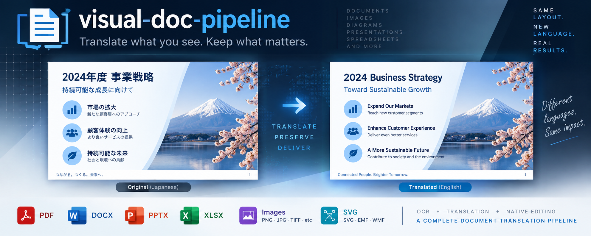
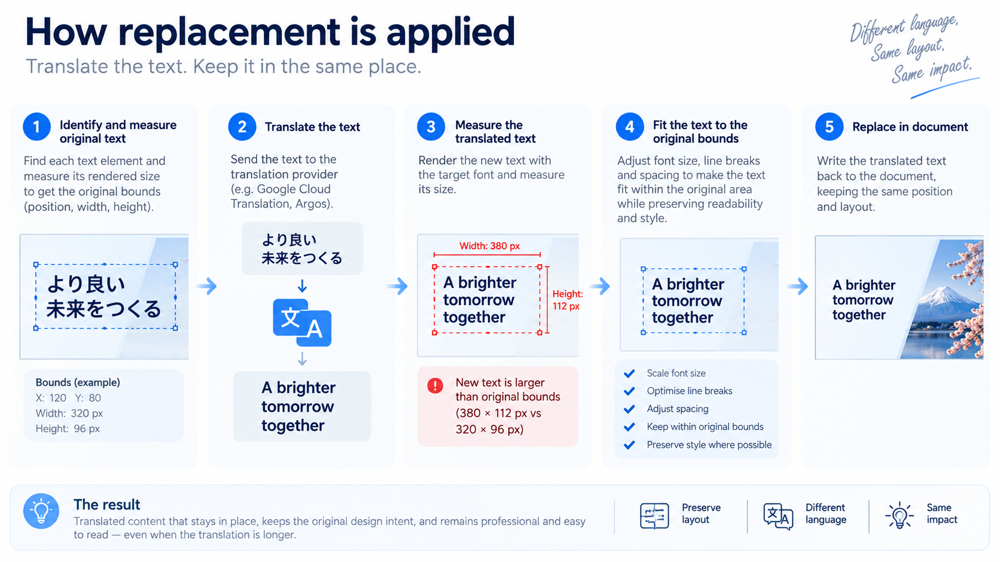
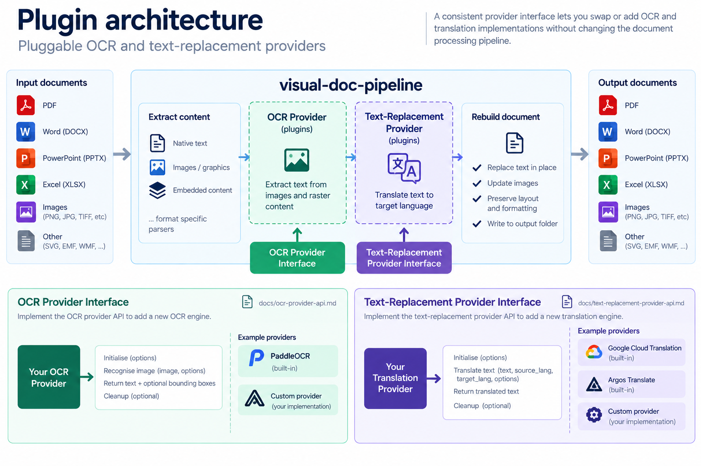

# visual-doc-pipeline



**Translate visible text across document folders while keeping the documents usable.**

`visual-doc-pipeline` is a folder-level document-processing tool for engineers
who need more than string replacement. It recursively processes documents and
images, including their supported nested content. It replaces editable text
natively where it can, applies OCR to visible bitmap text where it must, and
writes a corresponding output tree without changing the source files.

The primary interface is [`scripts/folder_replacement.py`](scripts/folder_replacement.py).
For normal use, run it in the supplied Docker image.

## Why use it

- **Works across a mixed document estate.** Process PDF, Word, PowerPoint,
  Excel, raster images, SVG, EMF, and WMF in one folder walk, including
  supported embedded content.
- **Keeps native content native where supported.** Editable text is replaced in
  its document format; embedded images and supported graphics take the OCR
  route instead of forcing an entire document into a bitmap.
- **Preserves the operational shape of the input.** The output keeps the input
  directory hierarchy and file formats. Unsupported files are reported and
  left alone; a failed file does not stop the rest of the batch.
- **Built for orchestration.** The command atomically updates `progress.json` in
  the output root while it runs, with overall progress, ETA, and per-file
  queued, processing, completed, failed, or skipped status. A self-hosted
  translation service can consume it without parsing terminal output.
- **Aims to preserve the source's intended presentation.** Translation often
  expands a string beyond its original space—particularly in PowerPoint—
  leaving slides unreadable and requiring a manual resizing pass. For supported bounded
  containers, layout modes use the source's available area and formatting to
  fit the replacement while preserving the document's visual intent.
- **Provider-based by design.** PaddleOCR and Google Cloud Translation are the
  built-in defaults. Argos Translate provides an offline translation option,
  and both OCR and text-replacement providers have documented extension points.

## What it processes

| Input | Processing approach |
|---|---|
| PNG, JPEG, TIFF, BMP, GIF, WebP | OCR, colour-aware background replacement, and rendered replacement text |
| PDF | Native text, annotations, forms, raster image XObjects, and eligible vector-outline text |
| DOCX | Native Word content, charts and their embedded Excel workbooks, plus supported media parts |
| PPTX | Native slide content, SmartArt, speaker notes, and supported media parts |
| XLSX | Native workbook content, charts, drawings, and supported media parts |
| SVG, EMF, WMF | Supported editable text records and contained bitmap payloads |

Every supported Office format processes supported raster and vector graphics in
its `media` parts. Word also follows supported chart relationships into their
embedded Excel workbooks. The [format-support guide](docs/folder-replacer-format-support.md)
maps the exact nested-content routes and boundaries.

## Quick start: Docker

The published CPU image is the recommended starting point:
`ghcr.io/kristc/visual-doc-pipeline-cpu:latest`. It fixes the input and output
roots inside the container at `/input` and `/output`, keeps the input read-only,
and runs the pipeline as a non-root user.

Run a folder through the default PaddleOCR and Google Cloud Translation
providers. Replace the three host paths with your input folder, output folder,
and service-account credential file:

```sh
docker run --rm --platform linux/amd64 --tty \
  --mount type=bind,src="/absolute/path/to/input",dst=/input,readonly \
  --mount type=bind,src="/absolute/path/to/output",dst=/output \
  --mount type=volume,src=visual-doc-pipeline-cache,dst=/runtime-cache \
  --mount type=bind,src="/absolute/path/to/service-account.json",dst=/run/secrets/google-application-credentials.json,readonly \
  ghcr.io/kristc/visual-doc-pipeline-cpu:latest \
  --source-language ja --target-language en
```

The first run downloads required runtime assets into the cache volume. The
default translation provider needs a Google Cloud service account with the
Cloud Translation API enabled. For credential setup, an NVIDIA GPU run, local
translation with Argos, optional plugins or fonts, and platform notes, read the
[container usage guide](docs/container-usage.md).

To inspect every available option and provider:

```sh
docker run --rm --platform linux/amd64 \
  ghcr.io/kristc/visual-doc-pipeline-cpu:latest --help
```

## How replacement is applied



The pipeline chooses the least destructive supported route for each piece of
visible text:

1. It replaces eligible editable text in native document structures.
2. It traverses supported embedded images and graphics, using OCR where the
   visible text is raster content.
3. It writes processed copies beneath the output folder and reports processed,
   ignored, failed, and replaced items.

For bounded native text containers, `preserve-basic-layout` fits replacement
text into the available space using portable fonts. The default
`preserve-basic-layout-source-font` mode uses the same fitting calculation
while retaining source font references where practical. Some document content
is intentionally retained when a safe replacement cannot be established; the
[format-support guide](docs/folder-replacer-format-support.md) explains those
boundaries.

## Providers and extension points



The default combination is **PaddleOCR** for OCR and **Google Cloud Translation
Advanced v3** for text replacement. Select `argos_translate` with
`--text-replacement` when local translation is the better fit for your
workflow. Provider contracts make it possible to add suitable OCR or
text-replacement implementations without changing the folder-processing core.

- [Google Cloud Translation setup](docs/google-cloud-translation-setup.md)
- [OCR provider API](docs/ocr-provider-api.md)
- [Text-replacement provider API](docs/text-replacement-provider-api.md)

## Security by design

Document translation frequently handles sensitive and untrusted files. Security
boundaries are therefore part of the pipeline design, not an afterthought.

- **Constrained containers.** The image runs as a non-root user. Only `/output`
  and `/runtime-cache` are writable; input, credentials, plugins, and fonts are
  separate read-only mounts. Credentials are never copied into image layers,
  output, or the runtime cache.
- **Explicit cloud boundary.** Google Cloud Translation uses a least-privilege
  service account rather than an API key and defaults to the EU endpoint.
  Translation text crosses that boundary only when the operator selects the
  provider and supplies its credentials.
- **Conservative document processing.** The pipeline does not resolve external
  URLs or file references in vector graphics. PDF vector OCR is rendered
  locally with page-size limits to reduce resource-exhaustion risk from
  untrusted files.
- **Controlled runtime and supply chain.** Dependencies are locked, use a
  seven-day package cooldown, and are installed from wheels rather than source
  builds. Registry exceptions are narrowly pinned and hash-verified. The
  container does not install packages at startup; mounted provider plugins are
  explicitly treated as operator-trusted code.

These controls support a safer default deployment, but operators remain
responsible for approving their translation provider, credentials, input data,
and any mounted plugins. See the [container usage guide](docs/container-usage.md)
for the mount and credential model.

## Documentation

- [Container usage](docs/container-usage.md) — CPU and NVIDIA GPU builds, mounts,
  credentials, caches, plugins, and fonts.
- [Format support](docs/folder-replacer-format-support.md) — format-by-format
  behaviour, layout modes, and known limits.
- [Local development](docs/development.md) — environment setup, checks, Windows
  CUDA configuration, and evaluation workflows.
- [Project background](docs/project-background.md) — the problem this project is
  intended to solve and its original motivation.
- [Changelog](CHANGELOG.md) — release history and delivered capabilities.

The project design requirements are maintained in [requirements/](requirements/).
