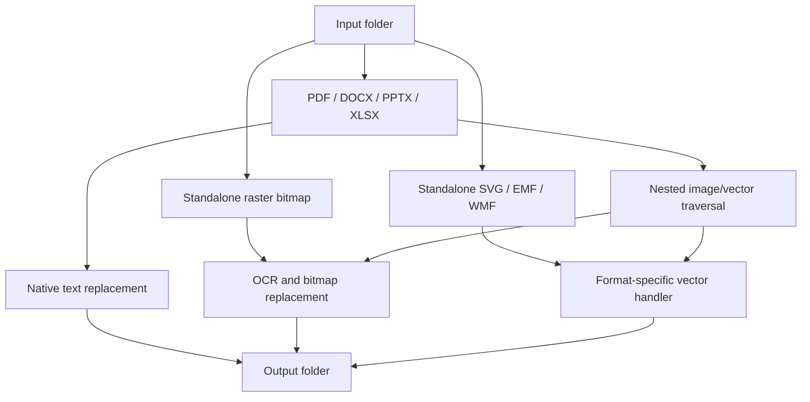
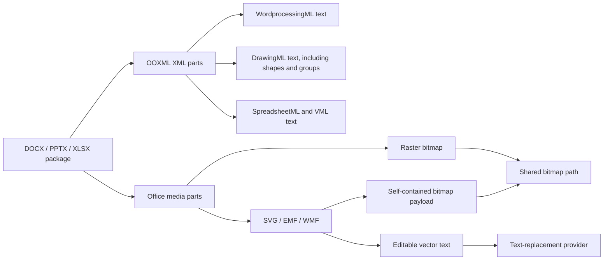
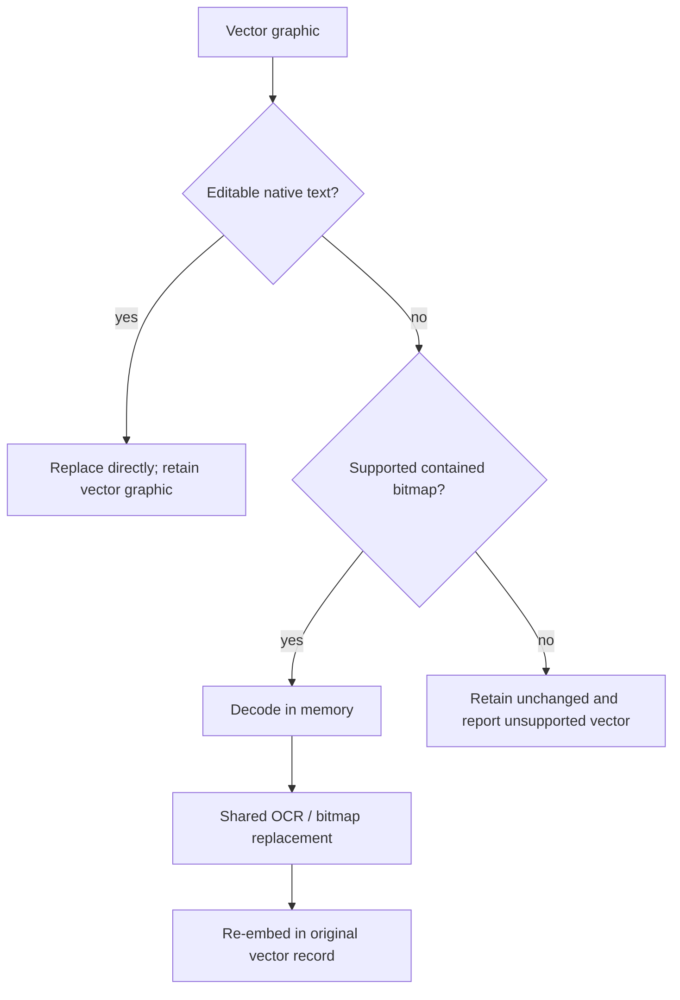

# Folder replacer: format support

`scripts/run_folder_replacement.py` walks an input directory recursively and writes a replacement-processed copy to an output directory. It retains the original file type and directory hierarchy. Unsupported files are ignored; a failure for one eligible input does not stop later files.

The command replaces visible text through two complementary routes:

- Native text is sent directly to the selected text-replacement provider.
- Raster text is detected by the selected OCR provider, then replaced by the shared bitmap renderer. OCR regions below 65% recognition confidence are left unchanged.

## Top-level input formats

| Input kind | Extensions | Processing route |
| --- | --- | --- |
| Raster bitmap | `.png`, `.jpg`, `.jpeg`, `.tif`, `.tiff`, `.bmp`, `.gif`, `.webp` | OCR and shared bitmap replacement |
| PDF | `.pdf` | Native PDF text plus page/Form-XObject raster images |
| Word | `.docx` | Native OOXML text, package media, and embedded vector parts |
| PowerPoint | `.pptx` | Native OOXML text, package media, and embedded vector parts |
| Excel | `.xlsx` | Native OOXML text, package media, and embedded vector parts |
| Vector graphic | `.svg`, `.emf`, `.wmf` | The same in-memory vector handler used for Office-embedded vector parts |

## Document traversal

The document formats are not treated as flat files. The folder replacer follows the nested structures that can carry visible text or a bitmap.

For PDF, the traversal includes page content, reusable Form XObjects, annotations and AcroForm values/appearance streams, raster image XObjects, and raster images inside Form XObjects.

## Vector graphics

Vector graphics preserve vector content whenever possible. The handlers update the supported editable text records directly and only send an already-contained raster payload through OCR.

| Format | Direct text | Contained bitmap support |
| --- | --- | --- |
| SVG | `text`, `tspan`, and `textPath` | Supported bitmap `data:` URIs in `image` elements |
| EMF | `EMR_EXTTEXTOUTA` and `EMR_EXTTEXTOUTW` | `EMR_STRETCHDIBITS` |
| WMF | `META_TEXTOUT` and `META_EXTTEXTOUT` | `META_STRETCHDIB` |

Outlined/path-only text is not currently rasterized. Other EMF and WMF bitmap record types are also not currently processed.

## External-resource boundary

The replacer never fetches or opens a URL, filesystem path, package-relative path, or other external reference found inside a vector graphic. This avoids external data disclosure and makes output deterministic.

For SVG, only a supported bitmap encoded directly in a `data:` URI is processed. An external `href`, nested SVG, `foreignObject`, video, canvas, malformed data URI, or unsupported MIME type is left unchanged.

## Progress and results

The command prints the relative source path before processing it and shows a tqdm bar for each eligible input. A document bar includes native text plus its embedded media/vector work. The final summary reports processed, ignored, and failed files; replaced native text items; replaced OCR regions; and vector graphics retained because no supported replacement route was available.
