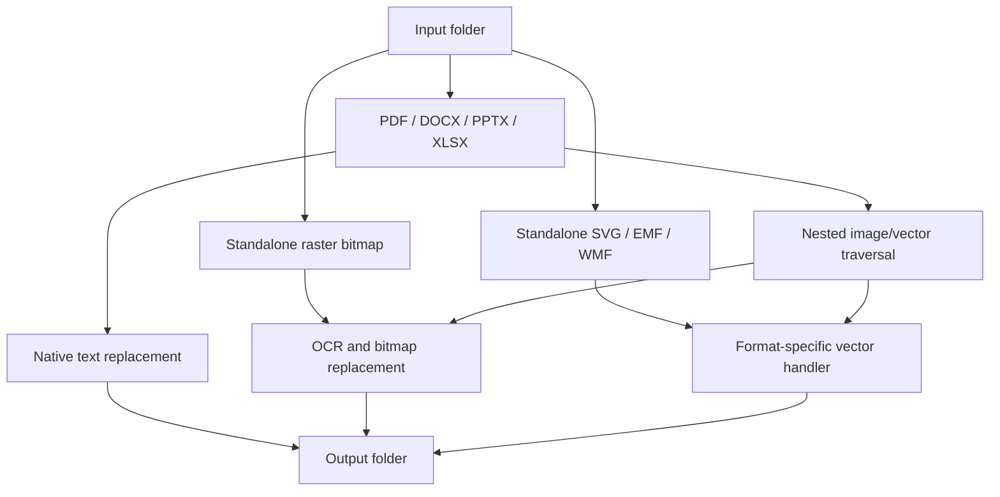

# Folder replacer: format support

`scripts/run_folder_replacement.py INPUT_FOLDER OUTPUT_FOLDER` recursively processes supported files and writes copies below the output folder. It preserves the directory hierarchy and source file format. Each output filename is first passed to the selected text-replacement provider with `is_filename=True`; collisions receive a numeric suffix. Unsupported files are ignored, and a failure for one eligible input is reported without stopping later files.

The command requires `--source-language` and defaults to `--target-language en`, `--text-replacement character_mask`, `--ocr paddleocr`, and `--document-text-layout preserve-source-formatting`.

## Top-level input formats

| Input kind | Extensions | Processing route |
|---|---|---|
| Raster bitmap | `.png`, `.jpg`, `.jpeg`, `.tif`, `.tiff`, `.bmp`, `.gif`, `.webp` | OCR, colour estimation, and shared bitmap replacement. Regions below 65% OCR confidence remain unchanged. |
| PDF | `.pdf` | Native PDF text, annotations and AcroForm data/appearances, plus raster image XObjects in pages and Form XObjects. |
| Word | `.docx` | Native OOXML text and Office media parts. |
| PowerPoint | `.pptx` | Native OOXML text, including SmartArt and speaker notes, and Office media parts. |
| Excel | `.xlsx` | Native OOXML text and Office media parts. Structured-table headers are retained unchanged. |
| Vector graphic | `.svg`, `.emf`, `.wmf` | The same in-memory vector handler used for Office-embedded vector parts. |

## Bitmap OCR path

Standalone bitmaps and supported raster payloads embedded in documents or vector graphics use the same in-memory path:

1. The selected OCR provider receives the bitmap and the requested source-language tag.
2. Each detected region with confidence below `0.65` is left unchanged. Colour-estimate confidence does not affect this decision.
3. For every remaining region, the selected text-replacement provider receives the recognized text, source language, and target language.
4. The pipeline estimates the region's text and immediate-background colours, then uses the shared batch renderer to wipe all eligible region backgrounds before drawing their replacement text.

The batch order prevents a later background wipe from covering a replacement rendered for an earlier nearby region. The bitmap is written back in its original format; the result count reports the number of OCR regions replaced.

## Native text and layout modes

Native text is sent to the selected text-replacement provider without an OCR-confidence threshold. The document-text layout option does not change bitmap replacement.

| Mode | Behaviour |
|---|---|
| `preserve-source-formatting` | Replaces native text while retaining existing source formatting. |
| `preserve-basic-layout` | For a container with a safe, finite text rectangle, uses repository-owned Noto fonts for deterministic fitting and writes explicit fitted formatting. Portable formats use Noto output where supported; EMF and WMF retain source face references because they have no safe portable-embedding path. Other containers use source-formatting replacement. |
| `preserve-basic-layout-source-font` | Uses the same fitting calculation but retains resolved source typeface references where possible; it is a best-effort portability trade-off. |

Bounded fitting applies to supported PPTX shapes, grouped shapes, and table cells; DOCX DrawingML text boxes; XLSX drawing text and cells with finite grid bounds; PDF FreeText annotations and editable AcroForm fields with finite rectangles; and SVG, EMF, or WMF text with an explicit usable clipping rectangle. It does not apply to flowing Word paragraphs, arbitrary PDF page/Form-content text, or unbounded SVG text. Unsupported or unsafe bounded containers still receive source-formatting replacement.

PPTX speaker notes always use direct OOXML replacement. Editable SmartArt and WordArt participate where their text can be safely handled; text converted to outlines or raster is not native editable text. XLSX structured-table header cells and their table metadata are deliberately left unchanged so structured references remain valid.

## Document traversal

Office documents are processed as packages rather than flat files. Visible WordprocessingML, DrawingML, SpreadsheetML, and VML text nodes are replaced throughout their eligible OOXML parts, including common content such as headers, footers, tables, comments, text boxes, grouped-shape text, notes, and shared spreadsheet strings. Raster and supported vector parts below an Office `media` directory are processed in place.

PDF processing includes page content and reusable Form XObjects, annotation and AcroForm values and appearance streams, and raster image XObjects, including those within Form XObjects. A PDF with an inline image that cannot safely be rewritten fails as one file; later inputs continue.

## DOCX Word smoke test

When changing DOCX fitted-text or embedded-font handling, generate a DOCX from
the synthetic folder-replacement test fixture and open it in a desktop version
of Microsoft Word. Confirm that Word displays no repair prompt, save the file
without changing it, and confirm that Word does not create a recovery or repair
log. This is a manual compatibility check; the automated suite separately
validates the OPC relationships, content types, font deobfuscation, and font
parsing without relying on a locally installed Word application.

## Vector graphics

Vector graphics retain vector content whenever possible. The handlers update supported editable text records directly and send only an already-contained raster payload through the shared bitmap path.

| Format | Direct text | Contained bitmap support |
|---|---|---|
| SVG | `text`, `tspan`, and `textPath` | Supported bitmap `data:` URIs in `image` elements |
| EMF | `EMR_EXTTEXTOUTA` and `EMR_EXTTEXTOUTW` | `EMR_STRETCHDIBITS` |
| WMF | `META_TEXTOUT` and `META_EXTTEXTOUT` | `META_STRETCHDIB` |

Outlined/path-only text is not rasterized. Other EMF and WMF bitmap record types are not currently processed.

## External-resource boundary

The replacer never fetches or opens a URL, filesystem path, package-relative path, or other external reference found inside a vector graphic. This prevents external data disclosure and preserves deterministic output.

For SVG, only supported bitmaps encoded directly in a `data:` URI are processed. External `href` values, nested SVG, `foreignObject`, video, canvas, malformed data URIs, and unsupported MIME types remain unchanged.

## Progress and results

The command prints each relative source path as processing begins and displays one tqdm work-item bar for that source file. A bitmap or standalone vector uses one work item. A document bar includes native-text work plus each embedded raster or supported vector part. The final summary reports processed, ignored, and failed files; replaced native-text items; replaced OCR regions; and vector graphics retained because they had neither editable text nor a supported embedded bitmap route.
