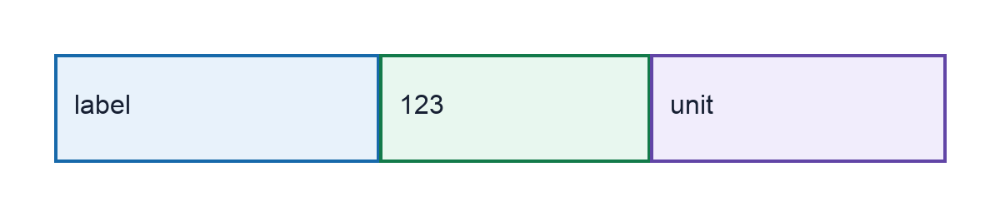
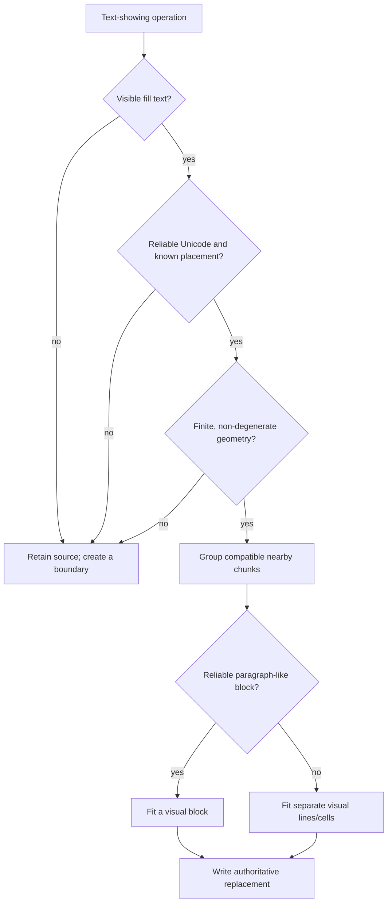

# PDF text replacement: a practical guide

This is an introduction to the PDF terms used by the requirements and the
PDF adapter. It is for engineers who understand documents but have not worked
with the PDF file format.

The short version: a PDF page is normally a drawing program, not a hierarchy
of paragraphs, runs, rows, and cells. Replacing visible text safely therefore
means reconstructing enough of the drawing instructions to preserve both the
appearance and the selectable text.

The authoritative behaviour is in
[feature requirements](../requirements/feature-requirements.md), especially
FR-2026-08-04-09, FR-2026-08-23-01 through FR-2026-08-23-06, and
FR-2026-08-24-01 through FR-2026-08-24-02. The implementation is
[the PDF adapter](../pipeline/folder_replacement/pdf.py).

For the standard, start with the PDF Association's free
[ISO 32000-2:2020 (PDF 2.0) resource](https://pdfa.org/resource/iso-32000-2/).
The most useful parts for this guide are clause 8 (graphics), clause 9 (text),
clause 10 (rendering), clause 12 (interactive features), and clause 14
(document interchange and tagged content). The repository also processes many
older PDFs; PDF 2.0 is used here as the clearest current reference.

## The mental model

PDF asks a viewer to paint marks on a page in sequence. It does not generally
say “draw this table cell” or “render this paragraph”. A source document can
therefore be visually simple but technically fragmented into separate font,
position, colour, and text-showing instructions.

The important consequence is that the code cannot use a `Tj`, `TJ`, or
`BT`/`ET` boundary as proof of a word, cell, or paragraph boundary. It derives
visual regions from positions, baselines, transforms, spacing, and paint state.

```mermaid
flowchart LR
    stream[Content stream: BT, Tf, Tm, Tj, ET] --> state[Track graphics and text state]
    state --> decode[Decode source bytes to Unicode]
    decode --> geometry[Calculate placed text chunks]
    geometry --> regions[Infer safe visual lines or blocks]
    regions --> provider[Text replacement provider]
    provider --> fit[Fit replacement into the visual region]
    fit --> output[Write visible and selectable replacement text]
```



## Small glossary

| Term | Plain-English meaning | Why the adapter cares |
|---|---|---|
| Content stream | A sequence of PDF instructions for painting a page or reusable object. | This is where page text is found. |
| Operator | One instruction, such as “select a font”, “move text position”, or “show text”. | Text meaning and placement are distributed across operators. |
| `BT` / `ET` | Begin/end a text object. This starts and ends a section of text instructions. | It resets some text state, but does not guarantee a visual paragraph boundary. |
| `Tf` | Select a font and font size. | Needed to decode glyph bytes and calculate their advances. |
| `Tm`, `Td`, `TD`, `T*` | Set or move the current text position. | Needed to place a replacement exactly once, without a missing or doubled transform. |
| `Tj` | Show one text string at the current position. | A common source-text operation. |
| `TJ` | Show an array of strings and numeric spacing adjustments. | One array can place several visual fragments or table cells. |
| Glyph | A drawable shape in a font; it is not necessarily a Unicode character. | A visible glyph alone is insufficient evidence of what text to replace. |
| Type0 font / CIDFont | A composite PDF font, usually used for large character sets such as CJK. | Its text bytes may use variable-width codes and separate CID widths. |
| CID | Character identifier inside a CIDFont. | Used for font-internal glyph selection and width lookup. |
| CMap | A map between character codes, CIDs, or Unicode. Several different CMaps can be present. | The correct direction of each map matters. |
| `/ToUnicode` | A mapping from the PDF's source codes to Unicode text. | It is the preferred evidence for selection, copy, search, and provider input. |
| `/W` and `/DW` | A Type0 descendant font's per-CID and default glyph widths. | They determine how far the text position advances. |
| `cm` / CTM | A graphics transform; CTM means current transformation matrix. | It converts local text placement into page coordinates, including scale and rotation. |
| `Tr` | Text rendering mode: fill, stroke, invisible, clipping, and combinations. | Only supported visible modes are eligible; clipping/invisible text is deliberately retained. |
| Form XObject | A reusable miniature content stream, painted on a page like a component. | It has its own local coordinates and must be processed recursively. |
| AcroForm / FreeText | Interactive form fields and text annotations. | Unlike page text, they have a finite `/Rect`, so bounded fitting is possible directly. |
| Marked content / `/ActualText` | Metadata wrapped around content, sometimes used for accessibility or copy/select behaviour. | A visual replacement is unsafe if alternate semantic text would remain stale. |

## `Tj` and `TJ`: showing text is not the same as storing a word

`Tj` is the compact form: it asks the viewer to show one encoded string.

```text
(Hello) Tj
```

`TJ` is an array. Strings are painted in order and numbers adjust the current
text position. A negative number often creates extra space; a positive number
often reduces it. The exact movement also depends on the active font size and
horizontal scale.

```text
[(Metric) -5200 (300,654) -900 (units)] TJ
```

That one instruction may paint the three cells in the following synthetic row.



This explains two important implementation rules:

1. The adapter retains the start and end advance of every `TJ` string
   fragment; it does not flatten the array before placement.
2. A large visual gap creates separate fitted visual regions. This prevents a
   replacement in one table cell from merging into the next cell.

An encoded whitespace fragment can also be one item in a `TJ` array. It is
valid positioning information. The adapter keeps it when decoding a `TJ` run
so that the surrounding visible fragments are not incorrectly rejected.

## Why visible text may be hard to decode

The bytes in a PDF text string are often font-specific codes rather than UTF-8
or UTF-16 text. A viewer needs font resources and mappings to turn them into
selectable Unicode.

```mermaid
flowchart LR
    bytes[Source bytes] --> encoding[Encoding CMap]
    encoding --> cid[CID]
    cid --> width[/W or /DW width]
    bytes --> unicode[/ToUnicode CMap]
    unicode --> text[Unicode text for copy, search, and replacement]
```

### The maps have different jobs

- The **encoding CMap** maps source bytes to CIDs. The adapter uses this
  direction when it needs a CID to look up a glyph width.
- The **`/ToUnicode` CMap** maps source bytes to Unicode. The adapter uses this
  direction to obtain the text sent to the replacement provider.
- The **embedded font's Unicode `cmap`** can be a narrowly constrained recovery
  path when `/ToUnicode` is absent or incomplete.

The adapter must not reverse a `/ToUnicode` mapping to choose a CID for new
text. Multiple CIDs can map to the same Unicode text, and the PDF does not
promise that the reverse mapping is safe. For generated replacement text it
instead uses a repository-owned portable font and writes an explicit,
unambiguous `/ToUnicode` mapping for the emitted glyphs.

### Why “I can select it in a viewer” is useful but not conclusive

Selection is strong evidence that the PDF contains a recovery route, and it is
worth investigating. It does not by itself prove that the pipeline can safely
replace the text. A viewer may use a private font fallback, heuristic, or
platform resource that is not embedded in the PDF.

The requirements deliberately permit only complete, unambiguous,
in-document evidence. This avoids sending guessed text to translation or
masking, and avoids moving later content using guessed widths. The adapter:

1. Parses the document's own `/ToUnicode` CMap, including its actual source
   code widths.
2. Uses the active encoding CMap and `/W` or `/DW` only for the source
   code-to-CID-to-width path.
3. Attempts embedded-font recovery only for the explicitly supported Identity
   CID configuration and only when every mapping is unambiguous.
4. Leaves genuinely opaque text unchanged, but continues after it when the
   source advance is known safely.

This is the meaning of “conservative” in the requirements: do not invent text,
CIDs, glyph widths, or geometry.

## From placed chunks to visual regions

The `preserve-basic-layout` mode is the layout-aware PDF path. It gathers
eligible chunks throughout a page-content or Form-XObject scope, tracks each
chunk's baseline, direction, size, advance, transform, and paint state, then
groups only compatible neighbours.



The compatibility checks are intentionally strict. The adapter does not merge
across a material change in direction, transform, table-like gap, column,
colour, opacity, clipping, or relevant graphics state. It supports ordinary
horizontal text and right-angle rotation; arbitrary-angle, sheared, path-only,
clipping-only, and image-only text are outside the fitted native-text scope.

This is why a table is normally treated as independent visual lines or cells,
not as a paragraph. It is safer to use a slightly smaller fitted replacement
inside each known area than to reflow a table row as prose.

## Visible text and selectable text must agree

Replacing paint alone is not sufficient. If the source `Tj` or `TJ` remains
as invisible text, a viewer may display the replacement but copy, search, or
extract the original content. FR-2026-08-24-02 requires the output semantics
to match the visible replacement.

| Output approach | What the viewer displays | What copy/search exposes |
|---|---|---|
| Visual-only overlay | Replacement text | Original source text - incorrect |
| Authoritative replacement | Replacement text | Replacement text - required |

For a safely replaced fitted region, the adapter:

1. Removes the source text-showing operations for that region.
2. Draws replacement glyphs with the portable font while the applicable paint
   state is active.
3. Restores the source text position so later independent page content keeps
   its original placement.
4. Adds widths and `/ToUnicode` mappings for every generated glyph, making
   selection, copy, search, and text extraction return the replacement.

`/ActualText` is the important exception. It can override or affect the text
that assistive technology and selection/copy expose. If the code cannot
safely update or remove the applicable alternate text, it retains the source
operation unchanged. This is preferable to creating a file that looks masked
but still exposes the original semantics.

## Requirements-to-code map

| Requirement | What it means in this guide | Main implementation area |
|---|---|---|
| FR-2026-08-04-09 | Handle page text, Form XObjects, fields, annotations, fonts, and CMaps with PDF-specific safety rules. | `replace_pdf_file`, content/annotation/form traversal |
| FR-2026-08-23-01 | Infer safe visual lines and blocks for fitted replacement instead of trusting arbitrary operators. | `_replace_pdf_fitted_operations`, `_pdf_visual_regions` |
| FR-2026-08-23-02 | Preserve the paint state at the original source location. | graphics-state tracking and anchored output |
| FR-2026-08-23-03 | Convert fill-and-stroke source text to predictable fill-only portable output. | text rendering mode handling |
| FR-2026-08-23-04 | Use actual Type0 CID widths for placement. | `_pdf_text_advance`, CID-width lookup |
| FR-2026-08-23-05 | Preserve position across an undecodable operation when its advance is still known. | `_pdf_undecodable_text_advance` |
| FR-2026-08-23-06 | Recover Unicode from a qualifying embedded Identity CID font when `/ToUnicode` is incomplete. | embedded-font recovery helpers |
| FR-2026-08-24-01 | Parse the document's `/ToUnicode` CMap directly when a high-level helper is unreliable. | direct CMap parser and decoder |
| FR-2026-08-24-02 | Make replacement text, rather than source text, authoritative for visual and semantic extraction. | generated-font metadata and source-operation removal |

## Modes and scope

| Mode | PDF page/Form-content text | Fields and FreeText annotations |
|---|---|---|
| `preserve-source-formatting` | Native replacement without fitted visual-region inference. | Native replacement; retain source formatting where safe. |
| `preserve-basic-layout` | Infer eligible visual regions, fit the replacement, and use the portable Noto output path. | Fit to the finite `/Rect` and write a clipped normal appearance. |
| `preserve-basic-layout-source-font` | Direct source-font replacement path; it is best effort and does not promise fitted visual-region equivalence. | Fit to the finite `/Rect` while retaining the source appearance face where safe. |

Text in raster images is a different route: it needs OCR and image rendering,
not native PDF text decoding. Outlined text is drawing geometry rather than
text-showing operations and is also outside this native-text path.

## How to investigate a missed run

Use a synthetic test before changing the parser or geometry rules. Do not add
customer document text, filenames, or derived output to a test fixture.

1. Confirm whether the run is a text-showing operator (`Tj`, `TJ`, `'`, or
   `"`) rather than an image, outline, annotation, or form appearance.
2. Record the active font, text rendering mode, text matrix, current
   transformation matrix, marked-content state, and graphics state.
3. Test source-byte decoding through `/ToUnicode`; for Type0 text, also test
   code boundaries, encoding-CMap CID lookup, and width lookup separately.
4. Determine whether the run is visible, has finite supported geometry, and
   can be separated from neighbouring table cells or columns.
5. Verify both outputs: render the page for visual layout, then extract/select
   text to check semantic replacement.

The test suite uses synthetic PDFs for these cases. This is both safer and
more maintainable: it exercises one rule at a time without preserving any
confidential source-document material.

## Further reading

- [ISO 32000-2:2020 (PDF 2.0) from the PDF Association](https://pdfa.org/resource/iso-32000-2/)
- [PDF specification archive, including PDF 1.7 and the ISO 32000 family](https://pdfa.org/resource/pdf-specification-archive/)
- [PDF 2.0 errata](https://pdf-issues.pdfa.org/32000-2-2020/)
- [PDF adapter source](../pipeline/folder_replacement/pdf.py)
- [Synthetic PDF regression tests](../tests/test_folder_replacement_pdf.py)
