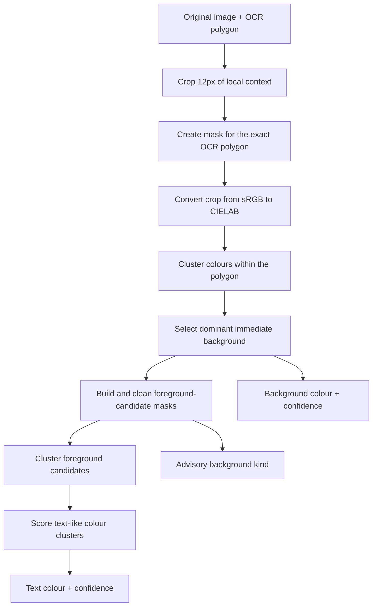
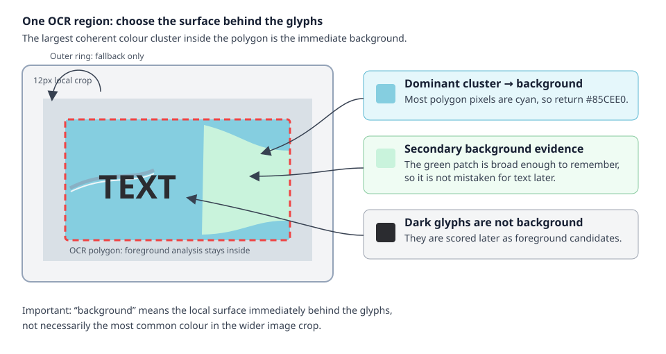
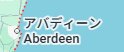
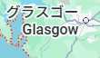
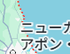

# Text-region-colour estimation algorithm

This is a design note for the current implementation of
`estimate_text_region_colours(image, ocr_text)`. It estimates the primary visible
text colour and immediate surface behind that text. It is deterministic and local:
it does not remove text, reconstruct an image, or infer hidden pre-composited
layers. For the public data types and usage, see the
[text-region-colour API](text-region-colours-api.md).

## The problem it is solving

An OCR polygon says where text probably is, but it can include more than text:

- local background pixels, including maps and label panels;
- antialiased edge pixels, which are mixtures of text and background;
- outlines and shadows; and
- nearby roads, icons, lines, or other labels when the OCR box is loose.

Simply averaging the polygon would usually return background. Selecting the most
different colour would often return a map feature. The estimator therefore asks
two separate questions: what surface is immediately behind the glyphs, and which
contrasting pixels behave most like text?

## Overall flow



The estimate is calculated from the original full-resolution image. The padded
OCR bitmap is not its input; it is used only by the local HTML evaluator.

## 1. Local context, constrained by the polygon

The estimator expands the OCR polygon's axis-aligned bounds by 12 source pixels
on each side, clipping at the source-image edge. Context helps distinguish a
local label panel from the wider image. A separate mask still restricts foreground
analysis to the actual polygon, including for rotated text.

This balances competing risks:

- a tight crop can contain too little uncontaminated background;
- unrestricted context can let unrelated artwork dominate; and
- a loose OCR box remains ambiguous, which is why the result has confidence
  scores rather than a guarantee.

## 2. Why CIELAB is used

The RGB pixels are converted to CIELAB. Euclidean distance in Lab (called ΔE in
this document) is a better approximation of visible colour difference than the
same calculation in sRGB. Equal numeric RGB changes do not look equally large in
all parts of RGB space.

The returned `RgbaColour` still contains the original observed eight-bit sRGB
channels and alpha. The estimator groups RGB-derived Lab values, but it does not
try to reverse alpha compositing to recover a hidden source-layer colour.

## 3. Estimate the immediate background



Read the diagram from left to right. The crop provides context, but the red dashed
OCR polygon bounds foreground analysis. Cyan is the largest coherent cluster
inside that polygon, so it is the immediate background. The pale-green area is
remembered as secondary background evidence; the dark glyphs are considered later
as foreground candidates. The outer ring is consulted only when the polygon has
too little usable background evidence of its own.

The Lab pixels inside the polygon are clustered into at most four groups with a
small deterministic k-means-style routine. It starts from the median colour, adds
well-separated seed colours, and refines the centres. Four groups are a practical
limit for a small OCR region: enough to model common local variation without
letting individual pixels become their own explanation.

The largest interior cluster is the *dominant immediate background*. Its median
stored RGBA value becomes `background_colour`. Its local colour spread and its
share of polygon pixels provide the evidence for `background_colour_confidence`.
When alpha-zero pixels have sufficient support inside the polygon, they instead
form a transparent immediate-background surface. They remain excluded from
foreground candidates, which are always opaque source pixels.

Clusters with substantial support—at least 12% of the polygon and at least 12
pixels—are retained as secondary background evidence. This is important on a
patterned map: a broad second map colour should not automatically be called text
just because it differs from the dominant surface.

If an almost-solid polygon is substantially different from the crop's outer ring,
the outer ring is used as a fallback. It helps when the polygon contains too
little actual background. It is deliberately fallback evidence only, so a strong
local panel wins over the wider image.

## 4. Build foreground candidates

Every opaque pixel inside the polygon is compared with the background in Lab. The
initial difference threshold is:

```text
min(32, max(10, 3 × background spread + 8))
```

The adaptive part allows a naturally variable surface. The hard cap at 32 keeps
a complex map or photograph from inflating the threshold so much that thin dark
or light text vanishes.

The first candidate mask measures distance from every supported background
cluster. This excludes large patterned-background regions. If it leaves fewer
than the larger of eight pixels or 1% of the polygon, the estimator retries using
the dominant background alone. This fallback is needed because an antialiased
glyph shade can occasionally be grouped as a broad local colour.

The selected candidate mask then receives two deliberately gentle clean-ups:

1. Remove pixels with fewer than two neighbours in a 3×3 neighbourhood.
2. Remove connected components smaller than two pixels.

The aim is to discard isolated speckles, not to manufacture a perfect text mask
or join separate letters.

## 5. Decide which candidate colour is text

Candidate pixels are clustered again, into at most four colour groups. A group
must have at least the greater of eight pixels, 1% of the polygon, or 2% of the
candidate mask before it can win. This prevents a tiny high-contrast map marker
from outranking a real word.

Each remaining group receives the following signals.

| Signal | Rationale |
|---|---|
| Lab contrast | Text normally differs visibly from the surface directly behind it. |
| Background contact | A group made mostly of boundary-adjacent pixels is less convincing than an interior stroke. |
| Eroded core | A thick coherent component has pixels left after a one-pixel erosion. This helps identify noise, but thin glyphs may correctly have no core. |
| Stroke / area score | Very large components are less likely to be text; compact stroke-scale components are preferred. |
| Colour purity | A tight colour cluster is more likely to be a fill than a broad colour mixture. |

The geometry score uses low background contact (55%), core evidence (25%), and
stroke score (20%). The final candidate score uses geometry (35%), Lab contrast
(45%), and purity (20%). Contrast has the largest weight because a loose OCR
polygon can contain a pale, thick map fill beside thin dark glyphs. Geometry still
prevents a large contrasting background area from winning on contrast alone.

The median observed RGBA value of the winning group becomes `text_colour`.
Antialiased edge pixels may influence the result, but a coherent fill cluster is
more influential than isolated edge pixels. This is an observed pixel colour, not
a claim to recover an unantialiased font colour.

## 6. Complex-background safeguards

The supplied examples illustrate why both the dual candidate mask and the scoring
balance are needed.

| Example | Risk | Safeguard |
|---|---|---|
|  | Variable map surface can make the threshold too high for dark glyphs. | Cap the adaptive threshold and retry against the dominant background when broad-cluster filtering leaves too little evidence. |
|  | A real dark glyph shade can be grouped as secondary background evidence. | Use the dominant-background fallback rather than returning the local surface as foreground. |
|  | A loose polygon includes a pale-green map component that has a thicker interior than the black glyphs. | Give contrast greater weight than thickness while retaining geometry and minimum-evidence checks. |

These are safeguards, not hard-coded knowledge of any one image. Their behaviours
are protected by synthetic regression tests rather than by using supplied images
as automated test fixtures.

## 7. Confidence

Confidence is a deterministic heuristic, not a probability and not the OCR
engine's confidence. Scores are comparable only between estimates produced by
the same estimator version.

`text_colour_confidence` combines:

- contrast between selected text and immediate background;
- selected-colour consistency (low spread);
- the text-like geometry score;
- separation between the top two candidate scores; and
- how many foreground-mask pixels support the choice.

`background_colour_confidence` combines the dominant background cluster's local
consistency and its share of the polygon. A `complex` background receives no
automatic penalty: a local panel can still be a well-supported immediate
background even when the crop has many colours.

Low foreground confidence is useful output. It means the algorithm has little
evidence for preferring one candidate over another. A later replacement pipeline
should review it or use a caller-selected fallback instead of treating the chosen
colour as authoritative.

## 8. Advisory background classification

Non-text local pixels are classified as:

| Kind | Current threshold |
|---|---|
| `flat` | 90th-percentile Lab variation is at most 2 |
| `gradient` | Variation is above 2 and at most 20 |
| `complex` | Variation is above 20, or there is insufficient evidence |

This is intentionally coarse and advisory. In the current implementation,
`gradient` means the local variation lies in a moderate range; it is not a fitted
mathematical gradient. Neither this classification nor `background_colour` is
sufficient to reconstruct a gradient or complex background.

## What the algorithm intentionally does not do

- It does not use the recognised characters, language, font, or OCR confidence to
  predict a colour.
- It does not return outline or shadow colours, although their pixels can affect
  the local evidence.
- It does not create a final text mask, inpaint text, replace text, fit a gradient,
  or reconstruct a photographic background.
- It does not guarantee correctness when OCR geometry is poor. Confidence is the
  mechanism for communicating that uncertainty.

## Inspecting the behaviour

Run the local evaluator:

```sh
./run.sh scripts/run_colour_evaluations.py
```

It writes a table for each supplied input below
`outputs/evaluations/color-detection-examples/`. The table places the padded text
bitmap next to the recognised text and colour swatches, making it easy to identify
systematic errors without generating new bitmap artifacts.

The automated tests use only synthetic images. They cover flat, gradient,
patterned, transparent, outlined, shadowed, rotated, label-panel, and the complex
background cases discussed above. The supplied examples are for manual evaluation,
not an automated oracle.
